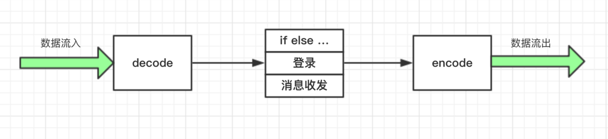
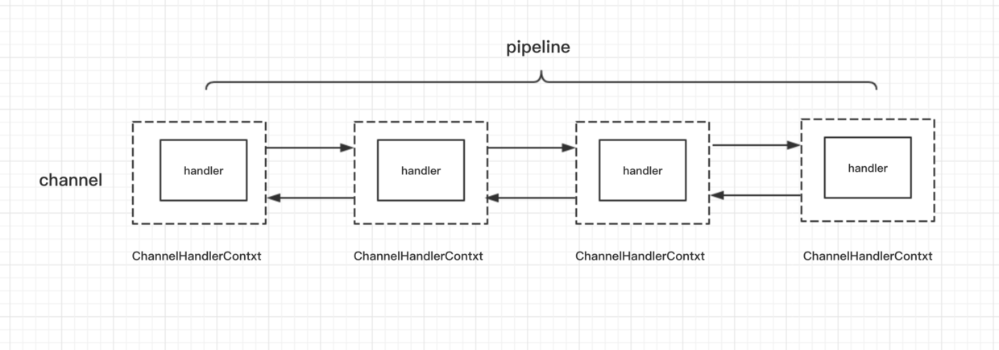
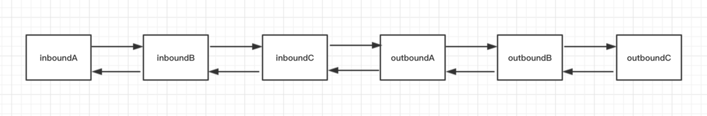
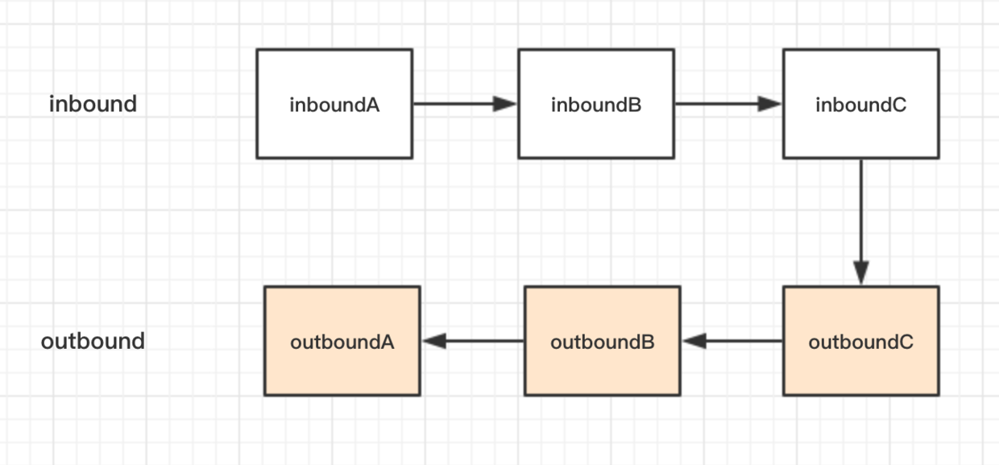

# (十)pipelineAndChildHandler
## 1,为什么要使用pipeline和ChildHandler

首先是数据流入,对它进行解码,将byteBuf变成响应的packet类,在上面的小节中写过,我们把这三类逻辑都写在一个类里面，客户端写在 ClientHandler，服务端写在 ServerHandler，如果要做功能的扩展（比如，我们要校验 magic number，或者其他特殊逻辑），只能在一个类里面去修改， 这个类就会变得越来越臃肿。
`另外，我们注意到，每次发指令数据包都要手动调用编码器编码成 ByteBuf，对于这类场景的编码优化，我们能想到的办法自然是模块化处理，不同的逻辑放置到单独的类来处理，最后将这些逻辑串联起来，形成一个完整的逻辑处理链。`
Netty 中的 pipeline 和 channelHandler 正是用来解决这个问题的：它通过责任链设计模式来组织代码逻辑，并且能够支持逻辑的动态添加和删除 ，Netty 能够支持各类协议的扩展，比如 HTTP，Websocket，Redis，靠的就是 pipeline 和 channelHandler.
```
避免过多的if...else
同时还要进行编码优化
```
## 2,pipeline 与 channelHandler 的构成

无论是从服务端来看，还是客户端来看，在 Netty 整个框架里面，一条连接对应着一个 Channel，这条 Channel 所有的处理逻辑都在一个叫做 ChannelPipeline 的对象里面，ChannelPipeline 是一个双向链表结构，他和 Channel 之间是一对一的关系。
```
一个channel对应着一个pipeline,每次数据的传输,都要经过一个pipeline
```
ChannelPipeline 里面每个节点都是一个 ChannelHandlerContext 对象，这个对象能够拿到和 Channel 相关的所有的上下文信息，然后这个对象包着一个重要的对象，那就是逻辑处理器 ChannelHandler。
```
结点类型就是ChannelHandlerContext,Channel相关的上下文信息,其中就是handler
```
## 3,channelHandler 的分类

可以看到 ChannelHandler 有两大子接口：

第一个子接口是 ChannelInboundHandler，从字面意思也可以猜到，他是处理**读数据**的逻辑，比如，我们在一端读到一段数据，**首先要解析这段数据，然后对这些数据做一系列逻辑处理，最终把响应写到对端， 在开始组装响应之前的所有的逻辑，都可以放置在 ChannelInboundHandler 里处理，它的一个最重要的方法就是 channelRead()**。读者可以将 ChannelInboundHandler 的逻辑处理过程与 TCP 的七层协议的解析联系起来，收到的数据一层层从物理层上升到我们的应用层。
```
相对于应用程序来说,Inbound就是读,从外向里面读
```
第二个子接口 ChannelOutBoundHandler 是处理写数据的逻辑，它是定义我们一端在组装完响应之后，把数据写到对端的逻辑，比如，我们封装好一个 response 对象，接下来我们有可能对这个 response 做一些其他的特殊逻辑，然后，再编码成 ByteBuf，最终写到对端，它里面最核心的一个方法就是 write()，读者可以将 ChannelOutBoundHandler 的逻辑处理过程与 TCP 的七层协议的封装过程联系起来，我们在应用层组装响应之后，通过层层协议的封装，直到最底层的物理层。

这两个子接口分别有对应的默认实现，**ChannelInboundHandlerAdapter**，和 **ChanneloutBoundHandlerAdapter**，它们分别实现了两大接口的所有功能，**默认情况下会把读写事件传播到下一个 handler。**
## 4,事件传播
### 4.1,Inbound的事件传播
```
public class InBoundHandlerA extends ChannelInboundHandlerAdapter {
    @Override
    public void channelRead(ChannelHandlerContext ctx, Object msg) throws Exception {
        System.out.println("InBoundHandlerA: " + msg);
        super.channelRead(ctx, msg);
    }
}

public class InBoundHandlerB extends ChannelInboundHandlerAdapter {
    @Override
    public void channelRead(ChannelHandlerContext ctx, Object msg) throws Exception {
        System.out.println("InBoundHandlerB: " + msg);
        super.channelRead(ctx, msg);
    }
}

public class InBoundHandlerC extends ChannelInboundHandlerAdapter {
    @Override
    public void channelRead(ChannelHandlerContext ctx, Object msg) throws Exception {
        System.out.println("InBoundHandlerC: " + msg);
        super.channelRead(ctx, msg);
    }
}
```
先解释一下场景,我们在netty的服务端,addLast以上三个Handler,当客户端和服务器建立连接的时候,我们的客户端会向服务器发送信息
```
InBoundHandlerA:PooledUnsafeDirectByteBuf(ridx: 0, widx: 16, cap: 1024)
InBoundHandlerB:PooledUnsafeDirectByteBuf(ridx: 0, widx: 16, cap: 1024)
InBoundHandlerC:PooledUnsafeDirectByteBuf(ridx: 0, widx: 16, cap: 1024)
```
在 channelRead() 方法里面，我们打印当前 handler 的信息，然后调用父类的 channelRead() 方法，而这里父类的 channelRead() 方法会自动调用到下一个 inBoundHandler 的 channelRead() 方法，并且会把当前 inBoundHandler 里处理完毕的对象传递到下一个 inBoundHandler，我们例子中传递的对象都是同一个 msg。

我们通过 addLast() 方法来为 pipeline 添加 inBoundHandler，当然，除了这个方法还有其他的方法，感兴趣的同学可以自行浏览一下 pipeline 的 api ，这里我们添加的顺序为 A -> B -> C，最后，我们来看一下控制台的输出
### 4.2,Outbound的事件传播
```
public class OutBoundHandlerA extends ChannelOutboundHandlerAdapter {
    @Override
    public void write(ChannelHandlerContext ctx, Object msg, ChannelPromise promise) throws Exception {
        System.out.println("OutBoundHandlerA: " + msg);
        super.write(ctx, msg, promise);
    }
}

public class OutBoundHandlerB extends ChannelOutboundHandlerAdapter {
    @Override
    public void write(ChannelHandlerContext ctx, Object msg, ChannelPromise promise) throws Exception {
        System.out.println("OutBoundHandlerB: " + msg);
        super.write(ctx, msg, promise);
    }
}

public class OutBoundHandlerC extends ChannelOutboundHandlerAdapter {
    public void write(ChannelHandlerContext ctx, Object msg, ChannelPromise promise) throws Exception {
        System.out.println("OutBoundHandlerC: " + msg);
        super.write(ctx, msg, promise);
    }
}
```
## 5,pipeline
### 5.1 pipeline 的结构

不管我们定义的是哪种类型的 handler, 最终它们都是以双向链表的方式连接，这里实际链表的节点是 ChannelHandlerContext，这里为了让结构清晰突出，可以直接把节点看作 ChannelHandlerContext。
### 5.2 pipeline 的执行顺序

虽然两种类型的 handler 在一个双向链表里，但是这两类 handler 的分工是不一样的，inBoundHandler 的事件通常只会传播到下一个 inBoundHandler，outBoundHandler 的事件通常只会传播到下一个 outBoundHandler，两者相互不受干扰。

## 6
通过我们前面编写客户端服务端处理逻辑，引出了 pipeline 和 channelHandler 的概念。
channelHandler 分为 inBound 和 outBound 两种类型的接口，分别是处理数据读与数据写的逻辑，可与 tcp 协议栈联系起来。
   
两种类型的 handler 均有相应的默认实现，默认会把事件传递到下一个，这里的传递事件其实说白了就是把本 handler 的处理结果传递到下一个 handler 继续处理。
inBoundHandler 的执行顺序与我们实际的添加顺序相同，而 outBoundHandler 则相反。

