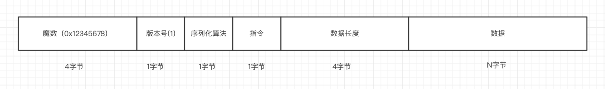
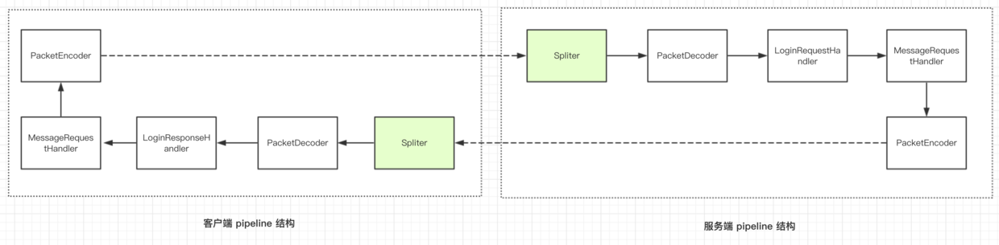

# (十三)拆包粘包理论和解决方案
## 拆包和粘包的现象
```
@Override
    public void channelActive(ChannelHandlerContext ctx) throws Exception {
        for(int i=0;i<1000;i++)
        {
            ctx.channel().writeAndFlush(getByteBuf(ctx));
        }
    }
```
我们在客户端,建立连接之后,我们向服务器发送1000条信息,然后我们在服务器接收,就会出现拆包和粘包的现象
## 为什么会出现拆包和粘包的现象
我们需要知道，尽管我们在应用层面使用了 Netty，但是对于操作系统来说，只认 TCP 协议，尽管我们的应用层是按照 ByteBuf 为 单位来发送数据，但是到了底层操作系统仍然是按照字节流发送数据，因此，数据到了服务端，也是按照字节流的方式读入，然后到了 Netty 应用层面，重新拼装成 ByteBuf，而这里的 ByteBuf 与客户端按顺序发送的 ByteBuf 可能是不对等的。因此，我们需要在客户端根据自定义协议来组装我们应用层的数据包，然后在服务端根据我们的应用层的协议来组装数据包，这个过程通常在服务端称为拆包，而在客户端称为粘包。

拆包和粘包是相对的，一端粘了包，另外一端就需要将粘过的包拆开，举个栗子，发送端将三个数据包粘成两个 TCP 数据包发送到接收端，接收端就需要根据应用协议将两个数据包重新组装成三个数据包。
## 拆包的原理
在没有 Netty 的情况下，用户如果自己需要拆包，基本原理就是不断从 TCP 缓冲区中读取数据，每次读取完都需要判断是否是一个完整的数据包

1,如果当前读取的数据不足以拼接成一个完整的业务数据包，那就保留该数据，继续从 TCP 缓冲区中读取，直到得到一个完整的数据包。
2,如果当前读到的数据加上已经读取的数据足够拼接成一个数据包，那就将已经读取的数据拼接上本次读取的数据，构成一个完整的业务数据包传递到业务逻辑，多余的数据仍然保留，以便和下次读到的数据尝试拼接。

如果我们自己实现拆包，这个过程将会非常麻烦，我们的每一种自定义协议，都需要自己实现，还需要考虑各种异常，而 Netty 自带的一些开箱即用的拆包器已经完全满足我们的需求了，下面我们来介绍一下 Netty 有哪些自带的拆包器。
## 如何使用 LengthFieldBasedFrameDecoder
首先，我们来回顾一下我们的自定义协议

详细的协议分析参考 客户端与服务端通信协议编解码这小节，这里不再赘述。 关于拆包，我们只需要关注

1,在我们的自定义协议中，我们的长度域在整个数据包的哪个地方，专业术语来说就是长度域相对整个数据包的偏移量是多少，这里显然是 4+1+1+1=7。
2,另外需要关注的就是，我们长度域的长度是多少，这里显然是 4。 有了长度域偏移量和长度域的长度，我们就可以构造一个拆包器。

`new LengthFieldBasedFrameDecoder(Integer.MAX_VALUE, 7, 4);`
其中，第一个参数指的是数据包的最大长度，第二个参数指的是长度域的偏移量，第三个参数指的是长度域的长度，这样一个拆包器写好之后，只需要在 pipeline 的最前面加上这个拆包器。
```
ch.pipeline().addLast(new LengthFieldBasedFrameDecoder(Integer.MAX_VALUE, 7, 4));
ch.pipeline().addLast(new PacketDecoder());
ch.pipeline().addLast(new LoginRequestHandler());
ch.pipeline().addLast(new MessageRequestHandler());
ch.pipeline().addLast(new PacketEncoder());
```
## 拒绝非本协议的连接
我们要在拆包器上面进行加强
```
public class Spliter extends LengthFieldBasedFrameDecoder{

    private static final int LENGTH_FIELD_OFFSET=7;
    private static final int LENGTH_FIELD_LENGTH=4;
    public Spliter()
    {
        super(Integer.MAX_VALUE,LENGTH_FIELD_OFFSET,LENGTH_FIELD_LENGTH);
    }
    @Override
    protected Object decode(ChannelHandlerContext ctx, ByteBuf in) throws Exception {

        //in在每次传入的时候,都只是一个开头
        if(in.getInt(in.readerIndex())!= PacketCodeC.MAGIC_NUMBER)
        {
            System.out.println("不是本协议,无法连接");
            ctx.channel().close();
            return null;
        }
        return super.decode(ctx, in);
    }
}
```

