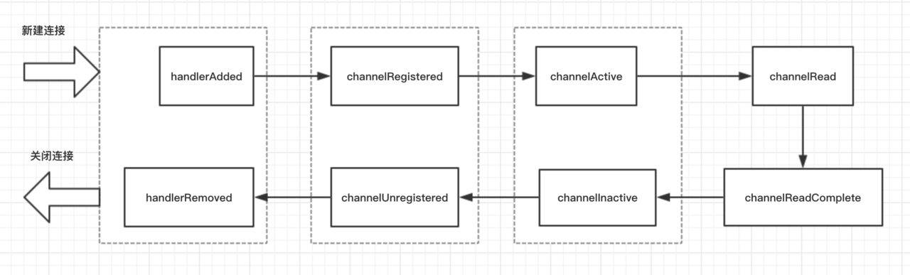

# (十四)channelContext的生命周期
## 实例
```
public class LifeCyCleTestHandler extends ChannelInboundHandlerAdapter{
    @Override
    public void handlerAdded(ChannelHandlerContext ctx) throws Exception {
        System.out.println("逻辑处理器被添加:handlerAdded()");
        super.handlerAdded(ctx);
    }
    @Override
    public void channelRegistered(ChannelHandlerContext ctx) throws Exception {
        System.out.println("channel绑定到线程(NioEventLoop):channelRegistered()");
        super.channelRegistered(ctx);
    }

    @Override
    public void channelActive(ChannelHandlerContext ctx) throws Exception {
        System.out.println("channel准备就绪:channelActive()");
        super.channelActive(ctx);
    }

    @Override
    public void channelRead(ChannelHandlerContext ctx, Object msg) throws Exception {
        System.out.println("channel有数据可读:channelRead()");
        super.channelRead(ctx, msg);
    }

    @Override
    public void channelReadComplete(ChannelHandlerContext ctx) throws Exception {
        System.out.println("channel的某次数据读完:channelReadComplete()");
        super.channelReadComplete(ctx);
    }

    @Override
    public void channelInactive(ChannelHandlerContext ctx) throws Exception {
        System.out.println("channel被关闭:channelClose()");
        super.channelInactive(ctx);
    }

    @Override
    public void channelUnregistered(ChannelHandlerContext ctx) throws Exception {
        System.out.println("channel取消线程的绑定:channelUnregistered()");
        super.channelUnregistered(ctx);
    }
    @Override
    public void handlerRemoved(ChannelHandlerContext ctx) throws Exception {
        System.out.println("逻辑处理器被移除:handlerRemoved()");
        super.handlerRemoved(ctx);
    }
}
```
当我们开启服务器,然后关上服务器,如下
```
逻辑处理器被添加:handlerAdded()
channel绑定到线程(NioEventLoop):channelRegistered()
channel准备就绪:channelActive()
channel有数据可读:channelRead()
Sun Jun 09 20:25:20 CST 2019:收到客户端登录请求....
Sun Jun 09 20:25:20 CST 2019:登录成功!!!
channel的某次数据读完:channelReadComplete()
channel的某次数据读完:channelReadComplete()
channel被关闭:channelClose()
channel取消线程的绑定:channelUnregistered()
逻辑处理器被移除:handlerRemoved()
```
handlerAdded() -> channelRegistered() -> channelActive() -> channelRead() -> channelReadComplete()


1,handlerAdded() ：`指的是当检测到新连接之后，调用 ch.pipeline().addLast(new LifeCyCleTestHandler()); 之后的回调`，表示在当前的 channel 中，已经成功添加了一个 handler 处理器。前提是建立了连接之后,然后才会调用回调方法.
2,channelRegistered()：`这个回调方法，表示当前的 channel 的所有的逻辑处理已经和某个 NIO 线程建立了绑定关系，类似我们在Netty 是什么？这小节中 BIO 编程中，accept 到新的连接，然后创建一个线程来处理这条连接的读写，只不过 Netty 里面是使用了线程池的方式，只需要从线程池里面去抓一个线程绑定在这个 channel 上即可，这里的 NIO 线程通常指的是 NioEventLoop,不理解没关系，后面我们还会讲到`一个channel要和NIO线程建立连接关系.一个channel绑定了一个线程.
3,channelActive()：当 channel 的所有的业务逻辑链准备完毕（也就是说 channel 的 pipeline 中已经添加完所有的 handler）以及绑定好一个 NIO 线程之后，这条连接算是真正激活了，接下来就会回调到此方法。在添加完handler之后以及绑定线程之后
4,channelRead()：客户端向服务端发来数据，每次都会回调此方法，表示有数据可读。有数据可读
 5,channelReadComplete()：服务端每次读完一次完整的数据之后，回调该方法，表示数据读取完毕。数据读完

channelInactive() -> channelUnregistered() -> handlerRemoved()


1,channelInactive(): 表面这条连接已经被关闭了，这条连接在 TCP 层面已经不再是 ESTABLISH 状态了
2,channelUnregistered(): 既然连接已经被关闭，那么与这条连接绑定的线程就不需要对这条连接负责了，这个回调就表明与这条连接对应的 NIO 线程移除掉对这条连接的处理
3,handlerRemoved()：最后，我们给这条连接上添加的所有的业务逻辑处理器都给移除掉。


## ChannelHandler 生命周期各回调方法用法举例
### 1, ChannelInitializer 的实现原理
仔细翻看一下我们的服务端启动代码，我们在给新连接定义 handler 的时候，其实只是通过 childHandler() 方法给新连接设置了一个 handler，这个 handler 就是 ChannelInitializer，而在 ChannelInitializer 的 initChannel() 方法里面，我们通过拿到 channel 对应的 pipeline，然后往里面塞 handler
```
.childHandler(new ChannelInitializer<NioSocketChannel>() {
    protected void initChannel(NioSocketChannel ch) {
        ch.pipeline().addLast(new LifeCyCleTestHandler());
        ch.pipeline().addLast(new PacketDecoder());
        ch.pipeline().addLast(new LoginRequestHandler());
        ch.pipeline().addLast(new MessageRequestHandler());
        ch.pipeline().addLast(new PacketEncoder());
    }
});
```
这里的 ChannelInitializer 其实就利用了 Netty 的 handler 生命周期中 channelRegistered() 与 handlerAdded() 两个特性，我们简单翻一翻 ChannelInitializer 这个类的源代码：
```
    protected abstract void initChannel(C ch) throws Exception;

    public final void channelRegistered(ChannelHandlerContext ctx) throws Exception {
        // ...
        initChannel(ctx);
        // ...
    }
    public void handlerAdded(ChannelHandlerContext ctx) throws Exception {
        // ...
        if (ctx.channel().isRegistered()) {
            initChannel(ctx);
        }
        // ...
    }
    private boolean initChannel(ChannelHandlerContext ctx) throws Exception {
        if (initMap.putIfAbsent(ctx, Boolean.TRUE) == null) {
            initChannel((C) ctx.channel());
            // ...
            return true;
        }
        return false;
    }
```
1,ChannelInitializer 定义了一个抽象的方法 initChannel()，这个抽象方法由我们自行实现，我们在服务端启动的流程里面的实现逻辑就是往 pipeline 里面塞我们的 handler 链
2,handlerAdded() 和 channelRegistered() 方法，都会尝试去调用 initChannel() 方法，initChannel() 使用 putIfAbsent() 来防止 initChannel() 被调用多次
3,如果你 debug 了 ChannelInitializer 的上述两个方法，你会发现，在 handlerAdded() 方法被调用的时候，channel 其实已经和某个线程绑定上了，所以，就我们的应用程序来说，这里的 channelRegistered() 其实是多余的，那为什么这里还要尝试调用一次呢？我猜测应该是担心我们自己写了个类继承自 ChannelInitializer，然后覆盖掉了 handlerAdded() 方法，这样即使覆盖掉，在 channelRegistered() 方法里面还有机会再调一次 initChannel()，把我们自定义的 handler 都添加到 pipeline 中去。
2. handlerAdded() 与 handlerRemoved()
这两个方法通常可以用在一些资源的申请和释放
3. channelActive() 与 channelInActive()
对我们的应用程序来说，这两个方法表明的含义是 TCP 连接的建立与释放，通常我们在这两个回调里面统计单机的连接数，channelActive() 被调用，连接数加一，channelInActive() 被调用，连接数减一
另外，我们也可以在 channelActive() 方法中，实现对客户端连接 ip 黑白名单的过滤，具体这里就不展开了

4. channelRead()

我们在前面小节讲拆包粘包原理，服务端根据自定义协议来进行拆包，其实就是在这个方法里面，每次读到一定的数据，都会累加到一个容器里面，然后判断是否能够拆出来一个完整的数据包，如果够的话就拆了之后，往下进行传递，这里就不过多展开.
5. channelReadComplete()

前面小节中，我们在每次向客户端写数据的时候，都通过 writeAndFlush() 的方法写并刷新到底层，其实这种方式不是特别高效，我们可以在之前调用 writeAndFlush() 的地方都调用 write() 方法，然后在这个方面里面调用 ctx.channel().flush() 方法，相当于一个批量刷新的机制，当然，如果你对性能要求没那么高，writeAndFlush() 足矣。
