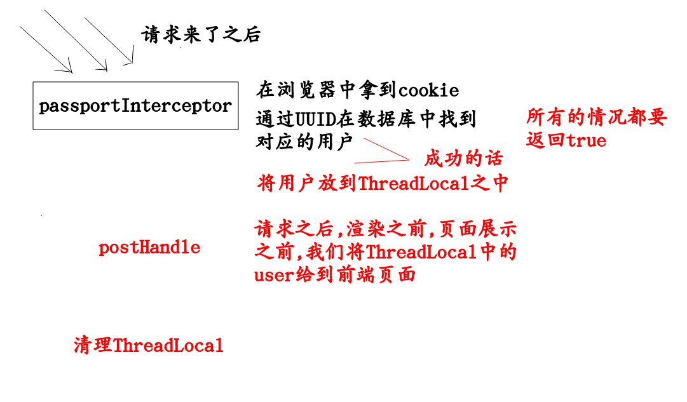

# (一)
## ThreadLocal的介绍

以上就是拦截器的作用,这个拦截器的作用,就是看看当前的进行访问的用户是否登录了,如果登录的话,我们就要对页面进行渲染,导航栏显示的就应该是这个人的头像,而不是(登录/注册)的字样
```
1,首先就是发出请求,这个拦截器拦截所有的请求
这个时候,页面还没有展示给用户,所以就是没有渲染.
我们获取cookie------>看看cookie中的值(一串变形的UUID)------>我们通过这一串UUID在数据库中找到那个用户的id
----->找到那个用户user------>放入到ThreadLocal
2,现在就要进行视图渲染了,也就是将导航栏的信息变成当前用户的头像,这个时候就是取ThreadLocal中的user了,get之后,塞给页面
3,请求结束了,我们销毁掉ThreadLocal中的user
```
每次请求,都塞入一个自己的变量,请求完毕都进行清除.