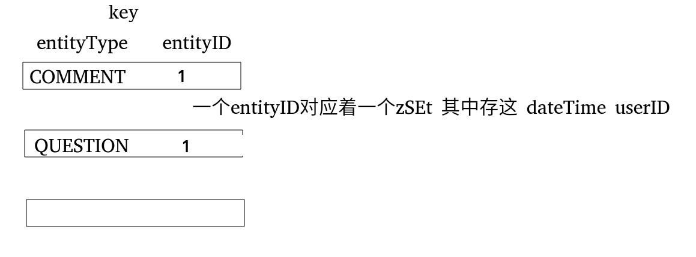
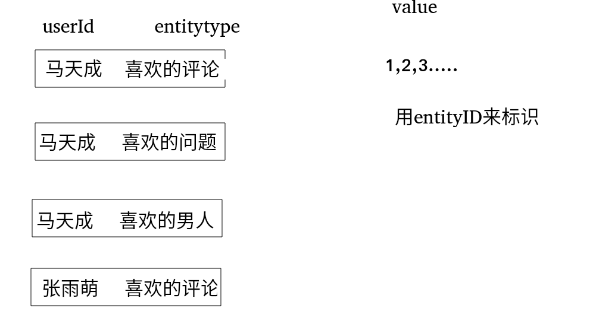
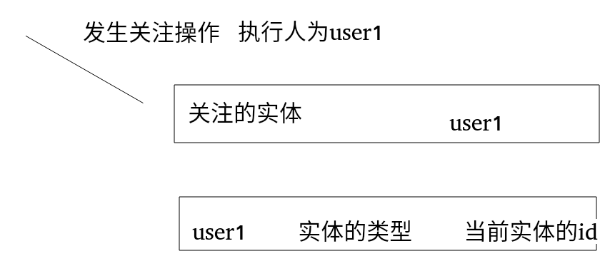

# 关注和粉丝列表(一)
## 粉丝操作的redis存储方式

上面是关注列表的生成,当前作用的对象是问题,评论,这些,存的是对象,其含义的entityType为.....的entityId为....(这时候就锁定了一个唯一的对象),然后在以这个唯一的对象为key,zadd插入数据,这个是有序集合,其中按照时间来顺序存放,对应的value值就是用户的id.
所以,在你关注某个实体的时候,我们要进行如下的操作
jedisAdapter.zadd(followerKey,date,userId);其中的followKey表示的是对当前实体的问题标识
**一个实体下有多少的用户id**
## 操作redis的存储方式
上面是针对一个实体(例如一个问题),然后就是针对与个人的操作了,


## 操作
###  关注实体
#### Service层
```
public boolean follow(int userId,int entityType,int entityId)
    {
        String followerKey= RedisKeyUtil.getFollowerKey(entityType,entityId);
        String followeeKey=RedisKeyUtil.getFolloweeKey(userId,entityType);
        Date date=new Date();
        Jedis jedis=jedisAdapter.getJedis();
        Transaction tx = jedisAdapter.multi(jedis);
        tx.zadd(followerKey,date.getTime(),String.valueOf(userId));
        tx.zadd(followeeKey,date.getTime(),String.valueOf(entityId));
        List<Object> res = jedisAdapter.exec(tx, jedis);
        return res.size()==2&&(Long)res.get(0)>0&&(Long)res.get(1)>0;
    }
```
获取两个key
* 实体底下的userid
* 当前用户关注的id
然后设置当前日期
开始事务,执行操作,分为两步,第一步,在第一个key的底下添加当前的用户,当前用户的底下添加关注的实体id,我们画一个图,来表示一下

而且执行的事务操作
#### Controller层
```
 @RequestMapping(path = {"/followUser"},method = {RequestMethod.GET,RequestMethod.POST})
    @ResponseBody
    public String followUser(@RequestParam("userId")int userId)
    {
        if(hostHolder.getUser()==null)
        {
           return ZhiHuUtil.getObjectJson(999);
        }
        boolean ret = followService.follow(hostHolder.getUser().getId(),
                EntityType.ENTITY_USER,userId);
        eventProducer.fireEvent(new EventModel(EventType.FOLLOW).setActorId(hostHolder.getUser().getId()).setEntityId(EntityType.ENTITY_USER).setEntityId(userId));
        return ZhiHuUtil.getJSONString(ret?0:1,String.valueOf(followService.getFolloweeCount(hostHolder.getUser().getId(),EntityType.ENTITY_USER)));
    }
```
判断当前用户是否登录,返回一个json,然后关注,这个时候,在两个key中添加了这个记录,然后使用异步队列,将信息发送给被关注的人,最后再返回一个json,
当前的用户的关注列表的count.这是关注用户,然后是关注问题
```
 @RequestMapping(path = {"/followQuestion"},method = {RequestMethod.POST})
    @ResponseBody
    public String followQuestion(@RequestParam("questionId")int questionId)
    {
        if(hostHolder.getUser()==null)
        {
            return ZhiHuUtil.getObjectJson(999);
        }
        Question question=questionService.getQuestionById(questionId+"");
        if(question==null)
        {
            return ZhiHuUtil.getJSONString(1,"the question not exists");
        }
        boolean res=followService.follow(hostHolder.getUser().getId(),EntityType.ENTITY_QUESTION,questionId);
        eventProducer.fireEvent(new EventModel(EventType.FOLLOW).setActorId(hostHolder.getUser().getId())
        .setEntityId(questionId).setEntityType(EntityType.ENTITY_QUESTION).setEntityOwnerId(question.getUserId()));

        Map<String,Object> info=new HashMap<>();
        info.put("id",hostHolder.getUser().getId());
        info.put("count",followService.getFollowerCount(EntityType.ENTITY_QUESTION, questionId));
        return ZhiHuUtil.getJSONString(res?0:1,String.valueOf(info));
    }
```
通过questionid得到要被关注的问题,然后执行关注操作,然后给发出问题的人发消息,通过异步队列,然后形成一个map,名字为info,这个时候关注操作已经实现了,这个时候要返回当前关注问题有多少人关注它.
###  取消关注实体
当前用户传入,实体的类型和实体的id传入,boolean类型,true为执行成功,false为执行失败
#### Service
```
public boolean unfollow(int userId,int entityType,int entityId)
    {
        String followerKey= RedisKeyUtil.getFollowerKey(entityType,entityId);
        String followeeKey=RedisKeyUtil.getFolloweeKey(userId,entityType);
        Date date=new Date();
        Jedis jedis=jedisAdapter.getJedis();
        Transaction tx = jedisAdapter.multi(jedis);
        tx.zrem(followerKey,String.valueOf(userId));
        tx.zrem(followeeKey,String.valueOf(entityId));
        List<Object> res = jedisAdapter.exec(tx, jedis);
        return res.size()==2&&(Long)res.get(0)>0&&(Long)res.get(1)>0;
    }
```
在自己的关注队列中减少一个id,在总的关注列表中减少一个userId,然后通过事务执行,然后我们看一下取消关注问题,和取消关注人物,
#### Controller
```
 @RequestMapping(path = {"/unfollowQuestion"}, method = {RequestMethod.POST})
    @ResponseBody
    public String unfollowQuestion(@RequestParam("questionId") int questionId) {

        if(hostHolder.getUser()==null)
        {
            return ZhiHuUtil.getObjectJson(999);
        }
        Question question=questionService.getQuestionById(questionId+"");
        if(question==null)
        {
            return ZhiHuUtil.getJSONString(1,"the question not exists");
        }
        boolean res=followService.unfollow(hostHolder.getUser().getId(),EntityType.ENTITY_QUESTION,questionId);
        eventProducer.fireEvent(new EventModel(EventType.FOLLOW).setActorId(hostHolder.getUser().getId())
                .setEntityId(questionId).setEntityType(EntityType.ENTITY_QUESTION).setEntityOwnerId(question.getUserId()));

        Map<String,Object> info=new HashMap<>();
        info.put("id",hostHolder.getUser().getId());
        info.put("count",followService.getFollowerCount(EntityType.ENTITY_QUESTION, questionId));
        return ZhiHuUtil.getJSONString(res?0:1,String.valueOf(info));
    }
```
取消关注问题,首先通过questionId得到问题,然后执行取消操作,然后形成一个名字为info的map,然后获取它在取消关注之后还有多少人在关注他,然后返回.
取消对人物的关注也是类似
```
  @RequestMapping(path = {"/unfollowerUser"},method = {RequestMethod.POST})
    @ResponseBody
    public String unfollowUser(@RequestParam("userId")int userId)
    {
        if(hostHolder.getUser()==null)
        {
            return ZhiHuUtil.getObjectJson(999);
        }
        boolean ret=followService.unfollow(hostHolder.getUser().getId(),
                EntityType.ENTITY_USER,userId);

        eventProducer.fireEvent(new EventModel(EventType.UNFOLLOW)
        .setActorId(hostHolder.getUser().getId()).setEntityId(userId)
        .setEntityType(EntityType.ENTITY_USER).setEntityOwnerId(userId));

        return ZhiHuUtil.getJSONString(ret?0:1,String.valueOf(followService.getFolloweeCount(hostHolder.getUser().getId(),EntityType.ENTITY_USER)));
    }
```
取消对人物的关注,然后查看自己还关注的人数.
**一个作用在自己(当执行对人物的关注),一个作用在其他(当对问题的操作的时候)**

### 其他操作
#### 得到当前问题被多少人关注
##### service
```
 public List<Integer> getFollowers(int entityType,int entityId,int count)
    {
        String followerKey=RedisKeyUtil.getFollowerKey(entityType,entityId);
        return getIdsFromSet(jedisAdapter.zrevrange(followerKey,0,count));
    }
    public List<Integer> getFollowers(int entityType,int entityId,int offset,int count)
    {
        String followerKey=RedisKeyUtil.getFollowerKey(entityType,entityId);
        return getIdsFromSet(jedisAdapter.zrevrange(followerKey,offset,offset+count));
    }
```
将自己的id和实体类型传入其中
#### 得到自己关注了多少的人
```
 public List<Integer> getFollowees(int userId, int entityType, int count) {
        String followeeKey = RedisKeyUtil.getFolloweeKey(userId, entityType);
        return getIdsFromSet(jedisAdapter.zrevrange(followeeKey, 0, count));
    }

    public List<Integer> getFollowees(int userId, int entityType, int offset, int count) {
        String followeeKey = RedisKeyUtil.getFolloweeKey(userId, entityType);
        return getIdsFromSet(jedisAdapter.zrevrange(followeeKey, offset, offset+count));
    }
```
将自己的id传入,然后在将关注的类型传入