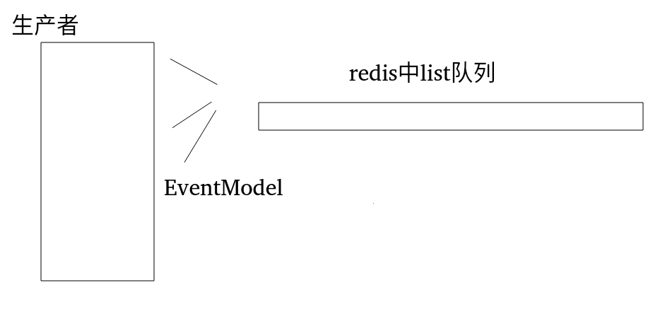
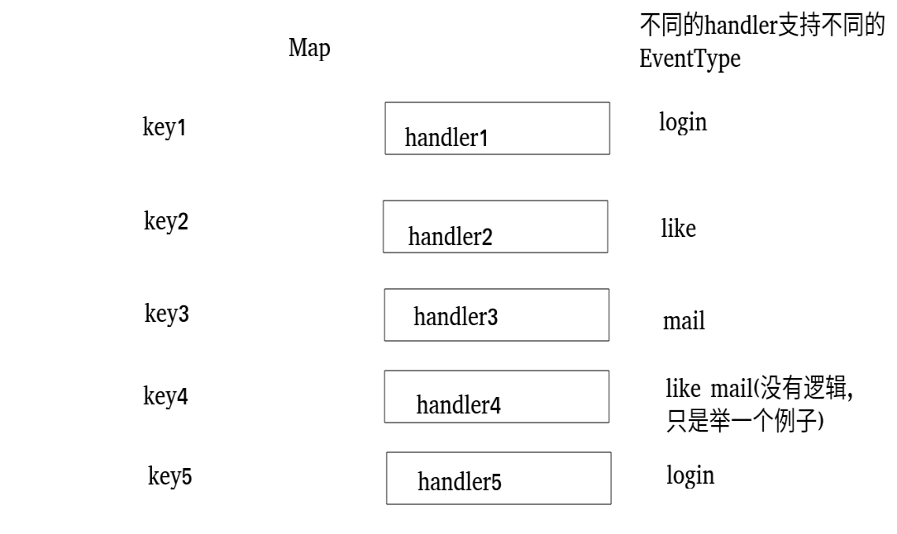
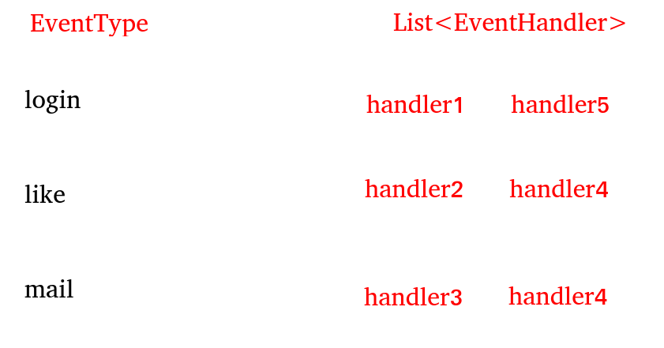

# 异步队列的实现(一)
## 传输的类型
首先我们定义一个枚举类型
如下
```
public enum EventType
{
   LIKE(0),COMMENT(1),LOGIN(2),MAIL(3);

   private int value;
   EventType(int value){this.value=value};
   public int getValue(){return value};
}
```
LIKE就是点赞类型的信息,COMMENT就是评论的信息,LOGIN就是登录的信息,MAIL就是邮件类型的信息
上面的枚举类型定义了消息传输的类型,但是传输的消息不能光有消息的类型,还有有消息的作用方和被作用方
```
public class EventModel
{
   private EventType type;//枚举类型
   private int actorId;//施加作用的一方
   private int entityType;//
   private int entityType;//
   private int entityOwner;//to id

   private Map<String,String> exts=new HashMap<>(); 
   
}
```
现在消息包我们就完成了,这个时候我们需要创建生产者和消费者
生产者,其中完成了就是传输包的功能,其中我们借助了redis
```
@Service
public class EventProducer {

   @Autowired
   JedisAdapter jedisAdapter;

   public boolean fireEvent(EventModel eventModel)
   {
       try {
          String json= JSONObject.toJSONString(eventModel);//将eventModel转化成json
          String key= RedisKeyUtil.getEventQueueKey();//在redis中维护了一个队列list
          jedisAdapter.lpush(key,json);//将这个json放入其中
          return true;//然后返回true
       }
       catch (Exception e)
       {
          return false;
       }
   }
}
```
我们来画个图表示一下生产者和异步队列,

然后我们来看一下消费者是怎么实现的,在消费者端会有多个实现handler的接口,来接收传过来的消息,我们先来看一下Handler接口
```
public interface EventHandler {

    void doHandler(EventModel model);//对于model的操作
    List<EventType> getSupportEventTypes();
    //当前支持的EventTypes是什么,比如说当前的handler实现的是login功能的操作,那么接收的EventType类型就是Login
}
```
然后我们在来看一下消费者什么怎么实现的
```
public class EventConsumer implements InitializingBean,ApplicationContextAware{

    private static final Logger logger= LoggerFactory.getLogger(EventConsumer.class);

    public Map<EventType,List<EventHandler>> config=new HashMap<>();

    private ApplicationContext applicationContext;`
```
其中实现了InitializingBean接口,是因为实现了接口,可以在初始化bean的时候,完成某些操作,其他的两个属性我们马上就解释
```
public void afterPropertiesSet() throws Exception {
        //得到spring容器中所有实现EventHandler的接口
        Map<String,EventHandler> beans=applicationContext.getBeansOfType(EventHandler.class);
        if(beans!=null)
        {   //遍历map
            for(Map.Entry<String,EventHandler> entry:beans.entrySet())
            {
                //当得到一个handler时,我们使用它接口的方法得到它它支持类型,它有可能只有一个,也可能有多个
                //即一个EventType完成的功能有多个,
                List<EventType> eventTypes=entry.getValue().getSupportEventTypes();
                //可以支持多个类型
                for(EventType type:eventTypes)
                {   //不同类型的EventType只用创建一个list就可以了 
                    if(!config.containsKey(type))
                    {
                        config.put(type,new ArrayList<>());
                    }
                    //根据type取一个
                    config.get(type).add(entry.getValue());
                }
            }
        }
```
原本的样子,这是最开始的map

经过处理之后,

现在消费者的队列就创建好了,我们现在开启一个线程,分别来用handler处理队列传来的信息
```
Thread thread=new Thread(()->{
            while(true)
            {
                String key= RedisKeyUtil.getEventQueueKey();
                List<String> events=jedisAdapter.brpop(0,key);
                for(String message:events)
                {
                    if(message.equals(key))
                    {
                        continue;
                    }
                    EventModel eventModel = JSON.parseObject(message,EventModel.class);
                    if(!config.containsKey(eventModel.getType()))
                    {
                        logger.error("can not know this event!!!!");
                        continue;
                    }
                    for(EventHandler handler:config.get(eventModel.getType()))
                    {
                        handler.doHandler(eventModel);
                    }
                }
            }

        });
        thread.start();
```
线程的意思大概就是,总结如下:
redis中的一个list就是这个异步队列,我们现在从list中取得一个元素,这个元素是list类型,它有两个元素,第一个元素就是key,第二个元素就是json,也就是我们要处理的数据,然后就进行核心操作,我们在刚刚生成的configmap,取得对应EventType的handler,让对应的handler对此进行处理.

以上就是异步队列的基本实现